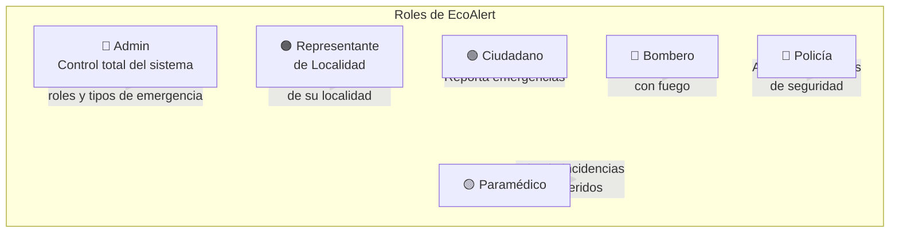
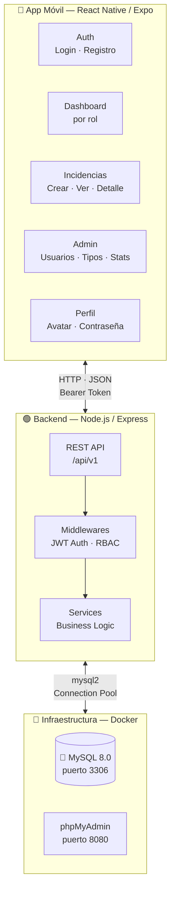
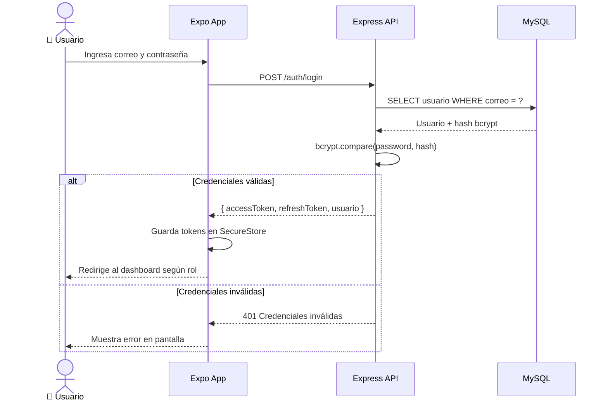
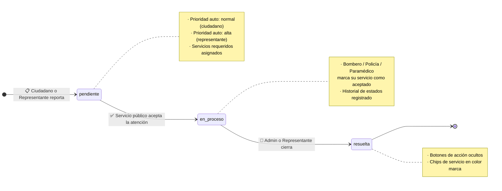
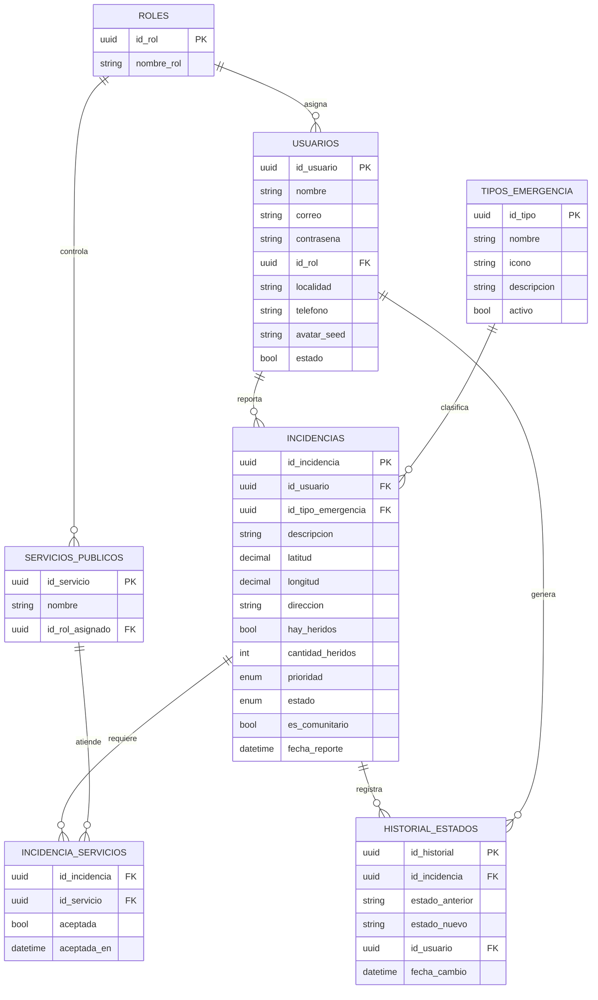

<div align="center">

# 🌿 EcoAlert 

### Sistema ciudadano de gestión de emergencias ambientales

*Cereté, Córdoba, Colombia*

<br/>

[](https://expo.dev)
[](https://www.typescriptlang.org)
[](https://nodejs.org)
[](https://www.mysql.com)
[](https://www.docker.com)
[](https://jwt.io)

<br/>

> **EcoAlert** conecta a ciudadanos afectados por emergencias ambientales con los servicios públicos de respuesta — bomberos, policía y asistencia médica — de manera ágil, priorizada e inteligente.

<br/>

</div>

---

## 📋 Tabla de contenido

- [¿Qué es EcoAlert?](#-qué-es-ecoalert)
- [Roles del sistema](#-roles-del-sistema)
- [Arquitectura](#-arquitectura)
- [Ciclo de vida de una incidencia](#-ciclo-de-vida-de-una-incidencia)
- [Esquema de base de datos](#-esquema-de-base-de-datos)
- [Stack tecnológico](#-stack-tecnológico)
- [Estructura del proyecto](#-estructura-del-proyecto)
- [Instalación y puesta en marcha](#-instalación-y-puesta-en-marcha)
- [Endpoints del API](#-endpoints-del-api)
- [Credenciales por defecto](#-credenciales-por-defecto)
- [Equipo](#-equipo)

---

## 🌱 ¿Qué es EcoAlert?

EcoAlert es una aplicación móvil desarrollada como **Trabajo de Grado** en la **Universidad de Cartagena — Ingeniería de Software (5.º semestre)**. La plataforma permite:

- 📣 **Reportar** emergencias ambientales geolocalizadas con nivel de prioridad automático
- 🚒 **Despachar** servicios de respuesta (bomberos, policía, paramédicos) según el tipo de incidencia
- 📊 **Supervisar** el estado en tiempo real con historial de cambios por incidencia
- 🛡️ **Controlar** el acceso mediante roles diferenciados (RBAC) con JWT

---

## 👥 Roles del sistema

Cada usuario tiene un rol que determina exactamente qué ve y qué puede hacer dentro de la app:



| Rol | Crea incidencias | Ve incidencias | Acepta servicio | Cambia estado | Gestiona usuarios |
|---|:---:|:---:|:---:|:---:|:---:|
| 🔴 Admin | ✅ | Todas | ❌ | ✅ | ✅ |
| 🟠 Representante | ✅ (prioridad alta) | Su localidad | ❌ | ✅ | ❌ |
| 🟢 Ciudadano | ✅ | Solo las suyas | ❌ | ❌ | ❌ |
| 🔵 Bombero | ❌ | Las de su servicio | ✅ | ✅ | ❌ |
| 🔵 Policía | ❌ | Las de su servicio | ✅ | ✅ | ❌ |
| 🟡 Paramédico | ❌ | Las de su servicio | ✅ | ✅ | ❌ |

---

## 🏗️ Arquitectura



### Flujo de autenticación



---

## 🔄 Ciclo de vida de una incidencia



---

## 🗄️ Esquema de base de datos



---

## 🛠️ Stack tecnológico

### 📱 Mobile
| Tecnología | Versión | Propósito |
|---|---|---|
| React Native | 0.76 | Framework UI multiplataforma |
| Expo | SDK 54 | Toolchain y runtime |
| TypeScript | 5.x | Tipado estático |
| Expo Router | v4 | Navegación basada en archivos |
| Zustand | 5.x | Estado global (auth store) |
| Axios | latest | Cliente HTTP + interceptores JWT |
| Expo SecureStore | latest | Almacenamiento seguro de tokens |
| Expo Location | latest | Geolocalización |
| DiceBear | (API) | Avatares generados por seed |

### 🟢 Backend
| Tecnología | Versión | Propósito |
|---|---|---|
| Node.js | 22+ | Runtime |
| Express | 4.x | Framework HTTP |
| TypeScript | 5.x | Tipado estático |
| mysql2 | latest | Driver MySQL con pools |
| bcryptjs | 2.x | Hashing de contraseñas |
| jsonwebtoken | latest | Access + Refresh tokens |

### 🐳 Infraestructura
| Tecnología | Propósito |
|---|---|
| Docker Compose | Orquestación de contenedores |
| MySQL 8.0 | Base de datos relacional |
| phpMyAdmin | Administración visual de BD |

---

## 📁 Estructura del proyecto

```
ecoalert/
│
├── 📱 mobile/                       # App React Native + Expo
│   ├── app/
│   │   ├── (auth)/                  # Pantallas públicas (login, registro)
│   │   ├── (tabs)/                  # Pantallas con tab bar (por rol)
│   │   │   ├── home.tsx             # Dashboard principal
│   │   │   ├── incidents.tsx        # Lista de incidencias
│   │   │   ├── create-incident.tsx  # Crear nueva incidencia
│   │   │   ├── profile.tsx          # Perfil + editar datos
│   │   │   ├── users.tsx            # Gestión de usuarios (Admin)
│   │   │   ├── emergency-types.tsx  # Tipos de emergencia (Admin)
│   │   │   └── statistics.tsx       # Estadísticas (Admin)
│   │   └── incident-detail.tsx      # Detalle completo de incidencia
│   └── src/
│       ├── core/
│       │   ├── services/            # API calls (Axios)
│       │   ├── stores/              # Zustand (authStore)
│       │   └── utils/              # roles, avatar, localidades
│       ├── features/
│       │   ├── admin/              # Hooks y componentes admin
│       │   └── incidents/          # Hooks y componentes incidencias
│       └── shared/                 # Componentes y UI reutilizables
│
├── 🟢 backend/                      # API REST Node.js + Express
│   └── src/
│       ├── features/
│       │   ├── auth/                # Login, registro, refresh token
│       │   ├── users/               # CRUD usuarios + roles
│       │   ├── incidents/           # CRUD incidencias + historial
│       │   ├── emergency-types/     # Tipos de emergencia
│       │   └── services/            # Servicios públicos
│       ├── core/
│       │   └── middleware/          # auth.middleware, roles.middleware
│       ├── infrastructure/
│       │   └── database/            # Conexión MySQL + migraciones
│       └── shared/
│           └── utils/               # response, bcrypt, jwt
│
├── 🐳 infrastructure/
│   └── docker/
│       └── docker-compose.yml       # MySQL 8 + phpMyAdmin
│
├── 📂 bruno-collection/             # Colección de pruebas de API (Bruno)
└── 📂 docs/                         # Guías y documentación adicional
```

---

## 🚀 Instalación y puesta en marcha

### Requisitos previos

- **Node.js** v22+
- **Docker Desktop** (en ejecución)
- **Expo Go** SDK 54 instalado en tu dispositivo Android
- **Bruno** para testing de API *(opcional)*

---

### 1️⃣ Clonar el repositorio

```bash
git clone https://github.com/BrayanArgumedo/ecoalert.git
cd ecoalert
```

---

### 2️⃣ Levantar la base de datos

```bash
cd infrastructure/docker
docker compose up -d
```

> Verifica en **http://localhost:8080** (phpMyAdmin)
> Usuario: `root` · Contraseña: `root`

---

### 3️⃣ Configurar y lanzar el backend

```bash
cd backend
cp .env.example .env    # editar si es necesario
npm install
npm run migrate         # crea tablas y usuario admin por defecto
npm run dev
```

> API disponible en **http://localhost:3000/api/v1**
> Health check: `GET /api/v1/health`

---

### 4️⃣ Configurar y lanzar la app móvil

```bash
cd mobile
cp .env.example .env
```

Edita `.env` con tu IP local (ejecuta `ip addr` o `ipconfig`):

```env
EXPO_PUBLIC_API_URL=http://192.168.X.X:3000/api/v1
```

```bash
npm install
npm start
```

Escanea el QR con **Expo Go** desde tu dispositivo.

---

### 5️⃣ Testing con Bruno *(opcional)*

Abre Bruno → **Open Collection** → selecciona la carpeta `bruno-collection/`
Selecciona el environment `local` en el dropdown superior derecho.

---

## 📡 Endpoints del API

Base URL: `/api/v1`

### 🔐 Auth
| Método | Endpoint | Descripción |
|---|---|---|
| `POST` | `/auth/register` | Registrar nuevo ciudadano |
| `POST` | `/auth/login` | Iniciar sesión |
| `POST` | `/auth/refresh` | Renovar access token |

### 👤 Usuarios *(requiere auth)*
| Método | Endpoint | Descripción | Rol |
|---|---|---|---|
| `GET` | `/users` | Listar todos los usuarios | Admin |
| `GET` | `/users/:id` | Ver usuario por ID | Admin / Propio |
| `PATCH` | `/users/:id` | Editar nombre, teléfono o contraseña | Admin / Propio |
| `PATCH` | `/users/:id/role` | Cambiar rol | Admin |
| `PATCH` | `/users/:id/status` | Activar / desactivar | Admin |
| `PATCH` | `/users/me/avatar` | Cambiar avatar | Propio |

### 🚨 Incidencias *(requiere auth)*
| Método | Endpoint | Descripción |
|---|---|---|
| `GET` | `/incidents` | Listar (filtrado por rol) |
| `GET` | `/incidents/:id` | Detalle de incidencia |
| `POST` | `/incidents` | Crear nueva incidencia |
| `PATCH` | `/incidents/:id/status` | Cambiar estado |
| `PATCH` | `/incidents/:id/accept` | Aceptar como servicio responder |
| `GET` | `/incidents/:id/history` | Historial de estados |

### 🏷️ Tipos de emergencia *(requiere auth)*
| Método | Endpoint | Descripción | Rol |
|---|---|---|---|
| `GET` | `/emergency-types` | Listar tipos | Todos |
| `POST` | `/emergency-types` | Crear tipo | Admin |
| `PATCH` | `/emergency-types/:id` | Editar tipo | Admin |
| `DELETE` | `/emergency-types/:id` | Eliminar tipo | Admin |

### 🚒 Servicios públicos *(requiere auth)*
| Método | Endpoint | Descripción |
|---|---|---|
| `GET` | `/services` | Listar servicios públicos |

---

## 🔑 Credenciales por defecto

Creadas automáticamente al ejecutar `npm run migrate`:

| Rol | Correo | Contraseña |
|---|---|---|
| 🔴 Admin | `admin@ecoalert.com` | `Admin123!` |

> Los demás usuarios se crean desde el módulo de registro (rol Ciudadano por defecto). El Admin puede cambiar el rol desde la app.

---

## 👨‍💻 Equipo

<div align="center">

Proyecto desarrollado como **Trabajo de Grado — Ingeniería de Software**

**Universidad de Cartagena · 5.º Semestre · 2025**

| Integrante | GitHub |
|---|---|
| Brayan Argumedo | [@BrayanArgumedo](https://github.com/BrayanArgumedo) |

</div>

---

<div align="center">

**EcoAlert** · Cereté, Córdoba, Colombia 🇨🇴

*Hecho con 💚 para proteger el medio ambiente y las comunidades*

</div>
